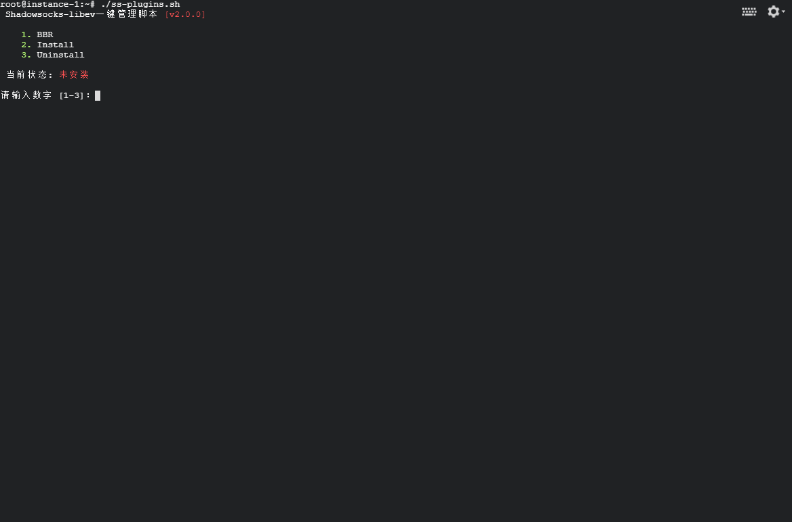
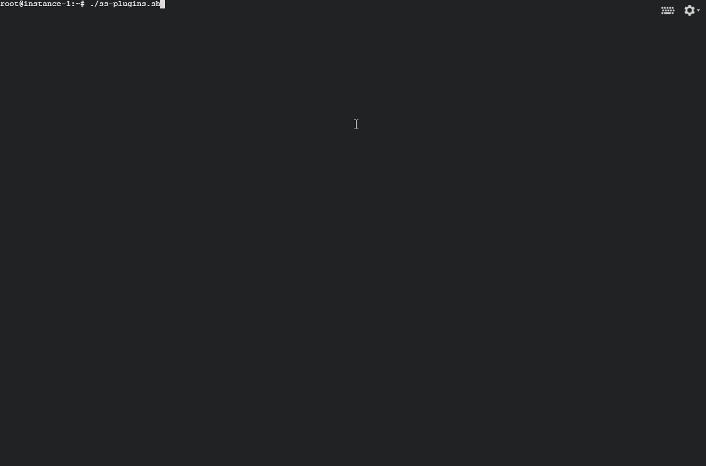
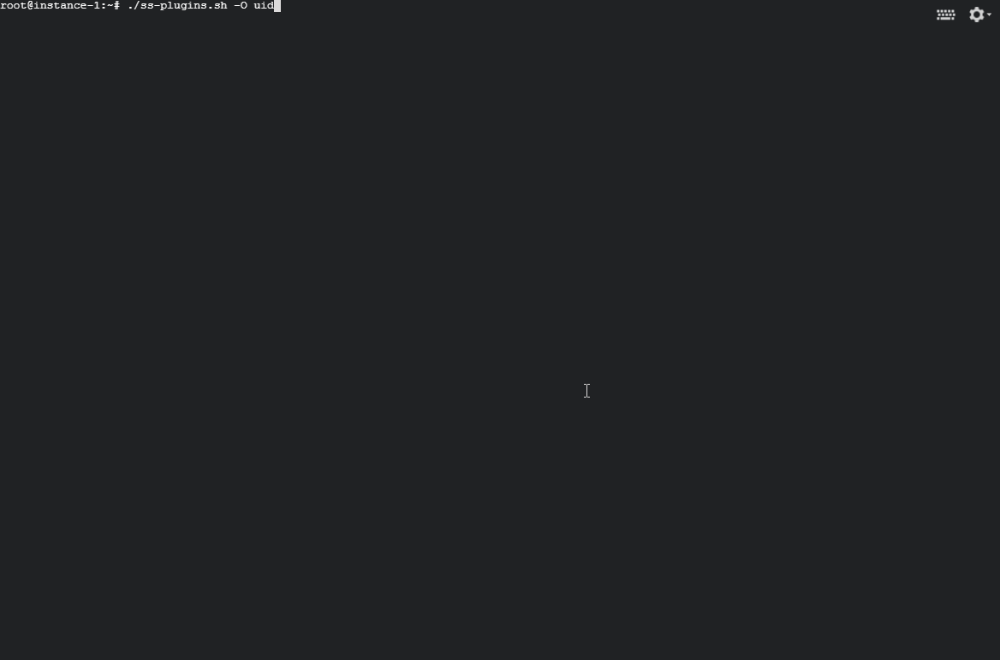

## ss-plugins.sh

#### 下载安装:
``` bash
wget -N --no-check-certificate -c -t3 -T60 -O ss-plugins.sh https://git.io/fjlbl
chmod +x ss-plugins.sh
./ss-plugins.sh
```

&nbsp;

```shell
Usage: 
./ss-plugins.sh [-O|-L|-H] [install|uninstall|update|start|stop|restart|status|show|uid|link|scan] [new_uid|ss_link]
```

&nbsp;

```shell
相关目录：

    SS-libev安装目录：/usr/local/bin
    SS-libev配置文件：/etc/shadowsocks-libev/config.json

    kcptun安装目录：/usr/local/kcptun
    kcptun配置文件：/etc/kcptun/config.json

    caddy安装目录：/usr/local/caddy
    caddy配置文件: /usr/local/caddy/Caddyfile
    caddy生成证书目录：~/.caddy/acme/acme-v02.api.letsencrypt.org/sites/xxx.xxx(域名)/

    acme.sh安装目录：~/.acme.sh
    acme.sh生成证书目录：~/.acme.sh/xxx.xxx(域名)/

    其它插件可执行二进制文件目录：/usr/local/bin
```

&nbsp;

1. ### 主菜单

```shell
  Shadowsocks-libev一键管理脚本 [v1.0.0]

  1. BBR
  2. Install
  3. Uninstall

 当前状态: 已安装 并 已启动

请输入数字 [1-3]：
```

&nbsp;

2. ### 可选插件与插件可选项

~~~shell
  1. v2ray
        1. ws+http
        2. ws+tls+[cdn]
        3. quic+tls+[cdn]
        4. ws+tls+web
        5. ws+tls+web+cdn
  2. kcptun
  3. simple-obfs
        1. http
        2. tls
  4. goquiet (unofficial)
  5. cloak (based goquiet)


注意：
    kcptun仅用于加速。
    simple-obfs已被弃用，但不影响使用。
    cloak是goquiet的升级版，增加了同端口，多用户。
    v2ray插件，带tls的都需要域名，cdn此处仅支持cloudflare，web则用了caddy。
	
    使用v2ray插件的选项3时，请在CloudFlare后台Network页面，找到QUIC BETA设置项，点击Join the Waitlist 进行申请
成功会收到邮件通知。由于是测试版，申请成功时间未定，也就意味着quic+tls+cdn，短时间无法使用。如需跳过cdn 只使用quic+tls 
则须将ss客户端的 <服务器地址> --> <改为ip> 来使用（如若，依旧要填写域名，请使用原域名服务器进行解析。）
	
    使用v2ray插件的选项5时，请将CloudFlare后台Crypto页面里的SSL设置，改为 Full 或 Full (strict) 模式（前者不验证
服务器证书，后者则会），否则，在浏览器打开你的域名会提示 ”重定向的次数过多“ 的错误！！！
	

	 
~~~

&nbsp;

3. ### 安装完毕，终端配置展示如下，以 ss + kcptun 为例：

~~~shell
 Shadowsocks的配置信息：

 地址     : 66.66.66.66
 端口     : 6666
 密码     : bc1xQkj3
 加密     : aes-256-gcm
 插件程序 : kcptun
 插件选项 :
 插件参数 : -l %SS_LOCAL_HOST%:%SS_LOCAL_PORT% -r %SS_REMOTE_HOST%:%SS_REMOTE_PORT% --crypt aes --key 0EP4edcP --mtu 1350 --sndwnd 1024 --rcvwnd 1024 --mode fast2 --datashard 10 --parityshard 3 --dscp 46 --nocomp true

 手机参数 : crypt=aes;key=0EP4edcP;mtu=1350;sndwnd=1024;rcvwnd=1024;mode=fast2;datashard=10;parityshard=3;dscp=46;nocomp=true

 SS  链接 : ss://YWVzLTI1Ni1nY206YmMxeFFrajM=@66.66.66.66:6666/?plugin=kcptun%3bcrypt%3daes%3bkey%3d0EP4edcP%3bmtu%3d1350%3bsndwnd%3d1024%3brcvwnd%3d1024%3bmode%3dfast2%3bdatashard%3d10%3bparityshard%3d3%3bdscp%3d46%3bnocomp%3dtrue
 SS二维码 : ./ss-plugins.sh scan < A link at the beginning of ss:// >


 [注意] SS链接不支持插件参数导入，请手动填写。使用kcptun插件时，该链接只支持手机导入.
        插件程序下载：https://github.com/xtaci/kcptun/releases 下载 windows-amd64 版本.
        请解压将带client字样的文件重命名为 kcptun.exe 并移至 SS-Windows 客户端-安装目录的根目录.
~~~

&nbsp;

4. ### 简略安装步骤-动图预览

**ss + v2ray-plugin**


**ss + kcptun**



**ss + simple-obfs**


**ss + goquiet**



**ss + cloak**


**ss + cloak2 用户管理**



本脚本改自于各路大神，水平马马虎虎，方便自用。

这里只对 linux-amd64 处理器架构做了支持，其它的就不要尝试了，推荐Ubuntu 18.04 LTS。

v2ray-plugin 所要用到的域名，可以从 [freenom.com](https://www.freenom.com) 获取免费域名， 申请需要挂代理，代理是哪国ip 就填写哪国的资料，不然会导致无法申请。 

另外，生成的 ss:// 链接，不支持插件参数导入，需要手动复制粘贴，使用 kcptun 插件时，该链接仅支持在手机上导入。

&nbsp;

**相关下载：**

- [shadowsocks-libev](https://github.com/shadowsocks/shadowsocks-libev)
- [shadowsocks-windows](<https://github.com/shadowsocks/shadowsocks-windows/releases>)
- [shadowsocks-android](<https://github.com/shadowsocks/shadowsocks-android/releases>)
- [v2ray-plugin](<https://github.com/shadowsocks/v2ray-plugin/releases>)
- [v2ray-plugin-android](<https://github.com/shadowsocks/v2ray-plugin-android/releases>)
- [kcptun](https://github.com/xtaci/kcptun/releases)
- [kcptun-android](https://github.com/shadowsocks/kcptun-android/releases)
- [simple-obfs(Deprecated)](https://github.com/shadowsocks/simple-obfs/releases)
- [simple-obfs-android](https://github.com/shadowsocks/simple-obfs-android/releases)
- [GoQuiet (unofficial)](https://github.com/cbeuw/GoQuiet/releases)
- [GoQuiet-android](https://github.com/cbeuw/GoQuiet-android/releases)
- [Cloak (based goquiet)](https://github.com/cbeuw/Cloak/releases)
- [Cloak-android](https://github.com/cbeuw/Cloak-android/releases)
